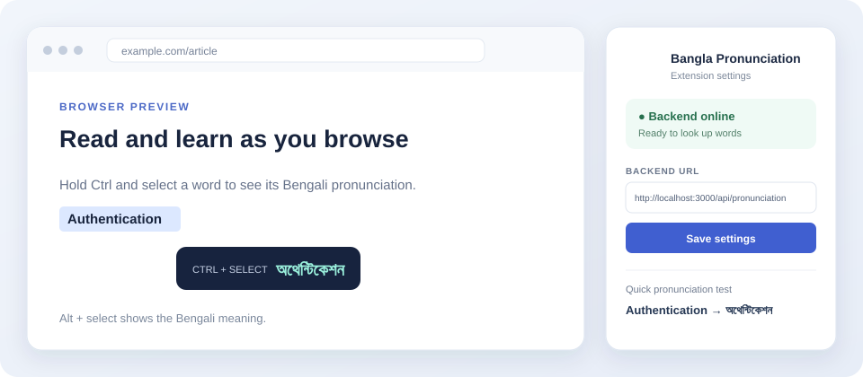

<div align="center">

# English to Bangla Pronunciation

Select English text to see its Bengali pronunciation or meaning in Chrome or Firefox.

[](https://github.com/SecurityTalent/English-to-Bangla-Pronunciation-Firefox/raw/refs/heads/main/dist/bangla-phonetic-pronunciation-chrome-v1.0.4.zip)
[](https://github.com/SecurityTalent/English-to-Bangla-Pronunciation-Firefox/raw/refs/heads/main/dist/bangla-phonetic-pronunciation-firefox-v1.0.2.zip)

<br>



</div>

## Use the extension

> [!IMPORTANT]
> **Pronunciation:** Hold **Ctrl** while selecting English text.
>
> **Bengali meaning:** Hold **Alt** while selecting English text.
>
> Select up to 500 characters. The result appears beside your selection.

The built-in dictionary works without an API key for supported pronunciation words. For other pronunciations and all meanings, connect the extension to a running backend with a Gemini API key.

## Quick setup

The extension needs two parts: the browser add-on and a small backend service. Follow these steps even if you are not a developer.

### 1. Install Node.js

Install **Node.js 18 or newer** from [nodejs.org](https://nodejs.org/). After installation, open PowerShell (Windows) or Terminal (macOS/Linux) in the project folder.

### 2. Get a Gemini API key

Create an API key in [Google AI Studio](https://aistudio.google.com/apikey). Keep the key private. Do not paste it into the extension, README, a screenshot, or a public GitHub file.

### 3. Add the key and start the backend

In PowerShell, run these commands from the project folder:

```powershell
npm.cmd --prefix backend install
if (-not (Test-Path backend/.env)) { Copy-Item backend/.env.example backend/.env }
notepad backend/.env
```

In Notepad, replace `your_gemini_api_key_here` after `GEMINI_API_KEY=` with your key, save the file, and close Notepad. Keep `backend/.env` on your computer; it is ignored by Git.

Start the backend:

```powershell
npm.cmd start
```

Leave this window open while using the extension. Open <http://localhost:3000/api/health> in your browser. A JSON response containing `"status":"ok"` means the backend is running. The `hasApiKey` field should be `true` for generated lookups.

On macOS or Linux, use `npm` instead of `npm.cmd`. For example: `npm --prefix backend install`, then `npm start`.

### 4. Install the browser extension

Download the package using one of the buttons at the top, then extract the ZIP file.

**Chrome**

1. Open `chrome://extensions`.
2. Turn on **Developer mode**.
3. Click **Load unpacked** and select the extracted Chrome package folder (the folder containing `manifest.json`).
4. If Chrome shows an older copy of this extension, remove it or reload the copy from the new folder.

**Firefox**

1. Extract the Firefox ZIP file.
2. Open `about:debugging#/runtime/this-firefox`.
3. Click **Load Temporary Add-on...** and select `manifest.json` inside the extracted Firefox package folder.

Firefox temporary add-ons are removed when Firefox restarts. A permanent public Firefox release must be signed by Mozilla; the ZIP in this repository is for temporary installation and testing.

### 5. Try a lookup

Open a normal website, hold **Ctrl**, and select a word. Hold **Alt** and select it to see its Bengali meaning. Click the extension's toolbar icon to check backend status, change the backend address, or test a word.

## API setup and endpoints

The backend reads its settings from `backend/.env`:

| Setting | What it does | Default |
| --- | --- | --- |
| `GEMINI_API_KEY` | Lets the backend ask Gemini for a result when the local dictionary/cache has no answer | No key |
| `PORT` | Port where the backend listens | `3000` |
| `GEMINI_MODEL` | Gemini model used for generation | `gemini-3.5-flash-lite` |

The extension's default backend URL is `http://localhost:3000/api/pronunciation`. The extension derives the meaning and health URLs from it. To use a different local port or a hosted backend, click the extension icon, enter the full pronunciation URL, and save it. For a hosted service, use its HTTPS URL, for example `https://your-domain.example/api/pronunciation`.

The API accepts JSON containing English text (up to 500 characters):

```http
POST /api/pronunciation
Content-Type: application/json

{"text":"authentication"}
```

It returns a `pronunciation` field in Bengali script. `POST /api/meaning` accepts the same JSON and returns a `meaning` field. `GET /api/health` reports whether the service is online, whether a key is configured, which model is selected, and the in-memory cache size. It does not return the API key.

## Deploying a public backend

The repository does **not** host a backend. The default `localhost` address only works on the computer running Node.js. Before giving the extension to public users:

1. Deploy the `backend/` Node.js service to a server with a public HTTPS address.
2. Configure `GEMINI_API_KEY` as a private environment variable in the hosting service. Never commit it.
3. Set `PORT` if the host requires it. The server listens on `process.env.PORT`.
4. Open `https://your-domain.example/api/health` and confirm it returns `"status":"ok"`.
5. Set the extension backend URL to `https://your-domain.example/api/pronunciation`, or update the default URL in both `chrome/background.js` and `firefox/background.js` and rebuild.
6. Protect a public API from abuse with suitable rate limits or authentication, and account for Gemini usage and costs.
7. Replace the contact placeholder in [PRIVACY.md](PRIVACY.md), publish that policy, and submit the extensions to their browser stores for review/signing.

## Build from source

To build both browser packages locally, run this from the project folder:

```powershell
npm.cmd run build
```

The generated ZIPs, unpacked extension folders, and Firefox XPI are written to `dist/`. Ready-to-download packages are also checked into this repository's `dist/` folder. To run the backend checks, stop any backend already using port 3000, then run `npm.cmd test`.

## Troubleshooting

- **Backend offline:** keep the backend terminal open and check <http://localhost:3000/api/health>.
- **Gemini key not configured:** check the `GEMINI_API_KEY` line in `backend/.env`, save it, and restart `npm.cmd start`.
- **Chrome reports an old content script:** update/reload the extension from the newly extracted folder, then refresh the website tab.
- **No result appears:** select English text while holding Ctrl or Alt; the selection must be 500 characters or fewer.
- **Port 3000 is already in use:** close the other server using that port, or choose another `PORT` in `backend/.env` and update the extension URL.
- **Chrome on the local demo page:** open the extension's Details page, enable **Allow access to file URLs**, and reload the demo tab.

## Privacy

Selected text is sent to the configured backend only when you request a lookup. The backend may send uncached text to Google Gemini. Review [PRIVACY.md](PRIVACY.md) before use. Do not send confidential text to a backend you do not trust.

## Project layout

- `chrome/` — Chrome extension source
- `firefox/` — Firefox extension source
- `backend/` — shared Node.js API
- `dist/` — built downloads and unpacked browser packages
- `docs/setup.md` — additional setup and release notes
- `PRIVACY.md` — privacy policy draft; complete its contact details before a public release
